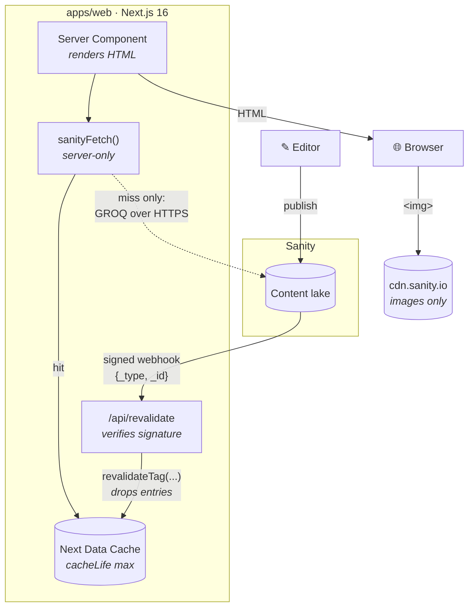

<!-- markdownlint-disable MD033 MD041 -->

<p align="center">
  
</p>

# Dětské skupiny

A public directory of Czech **dětské skupiny** — state-registered childcare
groups for under-fives. Parents browse a four-level geography tree (country →
region → area → subarea), filter by type, category and tag, search by name, and
land on a detail page with photographs, opening details and a map pin. The
content team runs the whole thing from a Sanity Studio; the site is served in
Czech and English from two separate domains. It is a Next.js 16 + Sanity v5 npm
monorepo.

**What this repository demonstrates is a production rescue.** An inherited
codebase — 500s on bad URLs, no tests, a five-minute cache timer, seven
denormalising Studio plugins and two cron scripts nobody scheduled — turned into
a system whose behaviour is measured, whose invariants are enforced by CI gates,
and whose decisions are written down. Every number below is traceable to a
committed document; the ones that could not be sourced are marked as such.

---

## Screenshots

<table>
  <tr>
    <td width="49%">
      
    </td>
    <td width="49%">
      
    </td>
  </tr>
  <tr>
    <td colspan="2" align="center"><em>The same homepage at desktop and mobile widths.</em></td>
  </tr>
</table>


<p align="center"><em>
  Catalog, filtered to one region. Filters are URL state; the list streams
  behind a Suspense boundary while the shell paints.
</em></p>


<p align="center"><em>
  Group detail. The place list beside every map is the map's accessible
  alternative — see <a href="docs/a11y.md">docs/a11y.md</a>.
</em></p>

---

## The journey

Starting state is the inherited tree at `725fab8`, the last commit before the
rescue began. Every row cites where its numbers come from.

| Dimension | Starting state | Final state | Source |
| --- | --- | --- | --- |
| **Bad URLs** | out-of-range catalog depth and unknown slugs threw → **500** | **404, never 500** — 11 e2e assertions over 5 bad-URL shapes | [`e2e/not-found.spec.ts`](e2e/not-found.spec.ts), [upgrade-verification](docs/upgrade-verification.md) 9b–9c |
| **Sanity traffic** | **per visit** — the UI dictionary used `revalidate: 0.5` under a comment claiming five minutes, so every render re-fetched it | **per publish** — `cacheLife("max")` + tags, invalidated by a signed webhook | [ADR-003](docs/adr/003-event-driven-cache.md) |
| **Publish → live** | up to **5 minutes** (`revalidate: 300`), and unobservable | **seconds**, with a `200` and the dropped tags in Sanity's delivery log | [ADR-003](docs/adr/003-event-driven-cache.md), [webhook doc](docs/webhook-and-computed-fields.md) |
| **Studio plugins** | **7** `autoPopulate*` plugins **+ 2 orphan cron scripts** (`schedules/*.mjs`, scheduled by nothing) | **1** plugin, `schools` only, awaited before publish | [ADR-002](docs/adr/002-remove-denormalization.md) |
| **Hand-written `any`** | **42** | **13** — and **0** in `apps/web/src` application code; the rest is `apps/studio`, which is still unlinted | measured, see [below](#how-the-any-count-was-measured) |
| **Automated tests** | **0** | **453** — 364 unit (23 files), 88 e2e (12 files), 1 full-site crawl | `npm run test`, `npx playwright test --list` |
| **Czech locale code** | `"cz"` — the ISO 3166 *country* code | `"cs"` — ISO 639-1, with a three-part data migration shipped in lockstep | [ADR-004](docs/adr/004-document-level-i18n.md) |
| **Next.js** | 15.3.6 — deprecated by its publisher, 7 high-severity advisories | **16.3.2**, App Router + Cache Components | [upgrade-verification](docs/upgrade-verification.md) |
| **Material UI** | 7.1.0, pinned by a root `overrides` block with no recorded reason | **9.3.1**, pin removed | [ADR-005](docs/adr/005-stay-on-mui.md) |
| **Bundle** | first-load JS, home: **340.0 kB** gzip | **344.4 kB** gzip — **+1.3%**. v9 grew it; taken anyway for the a11y work | [mui-v9-diff](docs/perf/mui-v9-diff.md) |
| **Lighthouse, home** | desktop **99** / mobile **71** | desktop **99** / mobile **69** — inside run-to-run noise | [mui-v9-diff](docs/perf/mui-v9-diff.md) |
| **Client-module source** | 34 files, 4,895 lines *(measured at the phase-7 branch point `b4c01e0`, not at `725fab8`)* | 3,773 lines after the boundary pushdown (**−22.9%**); **4,219 lines / 37 files today**, after the a11y and Studio work landed | [phase7-after](docs/perf/phase7-after.md), [client-surface](docs/client-surface.md) |
| **Accessibility** | no checks | strict axe gate — **serious and critical fail the build**; contrast unit-tested; landmarks, skip link, `h1` and `img alt` asserted on every crawled page | [docs/a11y.md](docs/a11y.md) |

### Numbers that could not be sourced

Three figures are deliberately **not** in the table above, because no committed
document supports them:

- **"1,900+ groups."** The dataset is not reachable from a build environment, so
  the corpus size is unverified here. Run
  `*[_type == "schools" && language == "cs"]{_id}` in Vision to confirm before
  quoting it publicly.
- **"Publish → live ≤ 10 minutes."** The inherited config was `revalidate: 300`
  — **5** minutes, plus Sanity CDN propagation. The table states the measured
  configuration rather than the recalled figure.
- **"~15 hand-written `any`."** The measured count at `725fab8` is **42**. The
  table uses the measurement.

#### How the `any` count was measured

Comments are stripped first — several of the surviving matches are prose
*describing* an `any` that was removed — then whole-word `any` is counted across
`apps/web/src` and `apps/studio`, excluding generated files and `.d.ts`:

| | `725fab8` | `HEAD` |
| --- | ---: | ---: |
| `apps/web/src` | 30 | **2** (both in `*.test.ts`) |
| `apps/studio` | 12 | 11 |
| **Total** | **42** | **13** |

---

## Architecture

The load-bearing property: **the browser never talks to Sanity.** The data
client is `server-only`, so an import from a client module fails the build. What
reaches the browser is HTML, and images from Sanity's CDN.



Read that path twice, because it is the whole design:

1. An editor publishes. Sanity POSTs a signed `{_type, _id}` to
   `/api/revalidate`.
2. The route verifies the signature, maps `_type` to cache tags, and calls
   `revalidateTag`. An unmapped type drops a catch-all tag, so an unrecognised
   publish **over**-invalidates rather than doing nothing.
3. The next request for an affected page misses the cache, runs its GROQ, and
   re-fills it. Every other request is a cache hit.
4. Nothing expires on a timer. `cacheLife("max")` means the webhook is the only
   thing that makes a publish visible — which is why it fails closed
   (401 on a bad signature, 503 on an unset secret) rather than open.

Why there is no database, and what would change that: [ADR-001](docs/adr/001-sanity-as-single-source.md).
Why the cache is event-driven rather than time-based: [ADR-003](docs/adr/003-event-driven-cache.md).

### Monorepo

```text
detske-skupiny/
├── apps/
│   ├── web/          Next.js 16 front end — App Router, RSC, Cache Components
│   └── studio/       Sanity v5 Studio — schemas, desk structure, 1 plugin, migrations
├── packages/
│   ├── config/       Constants both apps must agree on (the locale list)
│   └── types/        Generated Sanity types — schema.json → sanity.generated.ts
├── e2e/              Playwright specs and the breadth-first full-site crawler
├── docs/             Living docs, the perf series, and the ADRs
└── .github/          CI (every PR) and the weekly crawl
```

One repo, npm workspaces, no build orchestrator — and why:
[ADR-006](docs/adr/006-monorepo.md).

---

## Content management

<table>
  <tr>
    <td width="49%">
      
    </td>
    <td width="49%">
      
    </td>
  </tr>
</table>

The sidebar is a **tour of the content model, not a dump of it**: six named
sections (Content, Groups, Geography, Blog, Translations, Site) in the order an
editor actually works, with the document types that would let someone break the
site — orphan singletons, raw translation metadata — kept out of reach.

Translation is **document-level**: one document per language, linked by
`translation.metadata`, grouped by language in every list. The **Translations
section is the cockpit** — what exists in which language, and what is still
missing — and the dictionary's row previews name the locales each entry is
still empty in, so "what needs translating" is answerable by looking rather than
by querying.

Every list row earns its space. A row that would have read as an untitled
document id instead shows the name, the address and the region it belongs to.

Why document-level and not field-level, and what the `cz` → `cs` migration had
to touch: [ADR-004](docs/adr/004-document-level-i18n.md).

---

## Testing

Three layers, and **five CI gates**. The gates are the story; the counts are a
footnote.

### The gates

| Gate | What it makes impossible | Where |
| --- | --- | --- |
| **Strict axe** | Shipping a serious or critical accessibility violation. Moderate and minor print on every run as a visible backlog. | `e2e/a11y.spec.ts` |
| **Typegen drift** | A field renamed in the Studio without regenerating types. CI regenerates and fails on a dirty tree — offline, no project id needed. | `.github/workflows/ci.yml` |
| **ESLint boundaries** | An import that crosses a layer it should not (`app` ← `features` ← `sections`), and a `styled()` call in a module without `"use client"`. | `apps/web/eslint.config.mjs` |
| **`styled` / `sx` guards** | The three MUI v9 failure modes that typecheck and then render wrong: a non-serialisable `sx` from a server module, a `styled()` module-graph break, and styles object-spread onto a component as props. | `boundary/serializable-sx`, `boundary/client-only-styled`, `boundary/no-style-object-spread` |
| **Raw-key crawler check** | A dictionary key rendering to visitors as literal text. next-intl is configured to fall back to the key itself, so a missing translation renders as `contactFormPrivacyPolicyLinkLabel` — in the page, in production, silently. | `e2e/crawl.spec.ts` |

That last gate exists because it happened. The check flags any **visible text
node whose entire trimmed content** is a camelCase identifier. Matching the
whole node rather than searching inside it is what keeps it quiet: Czech prose
may well contain a camelCase word, but it does not consist of one. Text inside
`<code>`, `<pre>`, `<kbd>`, `<samp>` and `<var>` is exempt, and so is anything
in a `display: none` branch.

### The layers

| Layer | Command | Covers | Needs Sanity? |
| --- | --- | --- | --- |
| Unit (Vitest) | `npm run test` | pure functions, the contact and revalidate routes, every GROQ query, component smoke tests — **364 tests, 23 files** | no |
| E2E (Playwright) | `npm run test:e2e` | one spec per route against a real dev server — **88 tests, 12 files** | yes |
| Crawl (Playwright) | `npm run test:crawl` | every reachable page, breadth-first, all assertions above | yes |

`npm run test:all` runs all three in order. Full detail — every spec, the
locale-routing trick that makes `localhost` resolve to `cs`, and the console
allowlist — is in [docs/testing.md](docs/testing.md).

The GROQ suite is the one worth knowing about: it parses every exported query
with `groq-js` and evaluates the migrated ones against a synthetic dataset. A
query assembled from fragments can expand into something ungrammatical, and that
fails only when Sanity is asked to run it — which no build and no other unit
test would notice.

---

## Running locally

**Prerequisites:** Node ≥ 22 (`.nvmrc` pins it), and a Sanity project you can
read.

```bash
npm ci                                          # one lockfile, all workspaces
cp apps/web/.env.example    apps/web/.env.local
cp apps/studio/.env.example apps/studio/.env.local
npm run dev:web                                 # localhost:3000
npm run dev:studio                              # localhost:3333
```

### Domain-based locale routing

`next-intl` picks the locale from the request's **Host**, not from a path
prefix — there is no `/en/…`. For local development, add to `/etc/hosts`:

```text
127.0.0.1 cs.school.local
127.0.0.1 en.school.local
```

Then browse `http://cs.school.local:3000`. The test suite sidesteps this by
mapping Czech onto plain `localhost` and English onto `en.localhost`, so
`http://localhost:3000` resolves to `cs`.

### Environment variables

| Name | App | Where to obtain |
| --- | --- | --- |
| `SANITY_PROJECT_ID` | web | [sanity.io/manage](https://www.sanity.io/manage) → project → Settings |
| `SANITY_DATASET` | web | The dataset to read, e.g. `production` or `staging` |
| `SANITY_WEBHOOK_SECRET` | web | Generate with `openssl rand -hex 32`; must match the webhook in Sanity manage. **Unset ⇒ `/api/revalidate` returns 503.** |
| `NEXT_PUBLIC_CS_DOMAIN` | web | Czech domain, e.g. `cs.school.local` locally |
| `NEXT_PUBLIC_EN_DOMAIN` | web | English domain, e.g. `en.school.local` locally |
| `NEXT_PUBLIC_MAPTILER_API_KEY` | web | [cloud.maptiler.com](https://cloud.maptiler.com/account/keys/) → Keys |
| `BREVO_API_KEY` | web | [app.brevo.com](https://app.brevo.com/settings/api) → SMTP & API. Contact form delivery. |
| `TURNSTILE_SECRET_KEY` | web | [Cloudflare dash](https://dash.cloudflare.com/?to=/:account/turnstile) → Turnstile widget |
| `NEXT_PUBLIC_TURNSTILE_SITE_KEY` | web | Same widget. If unset, the widget is skipped in development. |
| `SANITY_STUDIO_PROJECT_ID` | studio | Same project as the web app |
| `SANITY_STUDIO_DATASET` | studio | Same dataset |
| `SANITY_STUDIO_API_VERSION` | studio | A date, e.g. `2025-11-01` |
| `SANITY_STUDIO_GOOGLE_MAPS_API_KEY` | studio | Google Cloud console → Maps JavaScript API. The geopoint input. |
| `SANITY_STUDIO_API_MAPTILER_API_KEY` | studio | Same MapTiler key. Publish-time geocoding. |
| `SANITY_SCRIPT_TOKEN` | studio, Node only | Sanity manage → API → Tokens (**Editor**). **Deliberately not `SANITY_STUDIO_*`-prefixed** — every such variable is inlined into the publicly served Studio bundle. Migrations only. |

### Scripts

| Command | What it does |
| --- | --- |
| `npm run dev:web` / `npm run dev:studio` | Development servers |
| `npm run build` · `npm run lint` · `npm run typecheck` | Fan out across workspaces |
| `npm run test` · `npm run test:e2e` · `npm run test:crawl` · `npm run test:all` | The three test layers |
| `npm run typegen` | Extract the Studio schema and regenerate `packages/types`. **Run after any schema change** — CI fails on a dirty tree. |
| `npm run shots` | Capture the six README screenshots. Needs a running dev server and a readable dataset; see [docs/images/README.md](docs/images/README.md). |
| `npm run migrate:locale -w apps/studio` | The `cz` → `cs` locale migration. Dry run by default; `-- --apply` to write. |
| `npm run migrate:dictionary -w apps/studio` | Fill missing dictionary entries. Dry run by default; `-- --apply` to write. Upserts by keyword and never overwrites an editor's text. |

---

## What I'd do at scale

Known next steps, in the order the constraints would actually bite. None is
started; each is here so the next person does not have to rediscover it.

**Postgres + PostGIS as a read model, at ~10k groups.** Sanity stays the editing
surface and the system of record; the same webhook that drives cache
invalidation today also syncs into Postgres, and the app reads from there. This
is what buys genuine geospatial queries — radius search, travel-time catchments
— which GROQ cannot express and which the map currently fakes by filtering
client-side over an already-fetched region. The trigger to start is a `count()`
subquery becoming the reason a page is slow on a cold cache
([ADR-001](docs/adr/001-sanity-as-single-source.md)).

**A custom translation dashboard.** The Translations section answers "what is
missing" well enough for two languages. A third would strain it: what is wanted
is a single view of every document against every locale, with staleness — source
edited after its translation — as a first-class state, plus bulk actions. That
is a Studio tool, not a structure list ([ADR-004](docs/adr/004-document-level-i18n.md)).

**Visual regression.** The suite asserts structure, behaviour and
accessibility, but nothing catches a layout that silently breaks — which is
precisely how the object-spread `sx` bug shipped: it typechecked, rendered, and
was simply unstyled. Playwright screenshot comparison on a handful of key
viewports, gated on the same synthetic dataset the perf harness already needs,
would close the one gap the current gates cannot.

**Sentry.** There is no production error reporting. The crawler catches console
errors and uncaught exceptions on every reachable page, but only weekly, only on
paths a crawler can reach, and never for a real visitor. Source-mapped releases
tied to the deploy would make a 500 in production something you learn from a
notification rather than from a support email.

---

## Documentation

| | |
| --- | --- |
| [docs/adr/](docs/adr/) | Six architecture decision records — the decisions and their revisit conditions |
| [docs/testing.md](docs/testing.md) | Every spec, the CI gates, how to run each layer |
| [docs/client-surface.md](docs/client-surface.md) | Every `"use client"` file and its justification; the three styling rules |
| [docs/a11y.md](docs/a11y.md) · [docs/keyboard-test.md](docs/keyboard-test.md) | Accessibility target, decisions, and the manual keyboard pass |
| [docs/seo.md](docs/seo.md) | Sitemaps, metadata, structured data, `hreflang` |
| [docs/perf/](docs/perf/) | The measurement series, chronological, honest results included |
| [docs/webhook-and-computed-fields.md](docs/webhook-and-computed-fields.md) | Webhook setup, tag mapping, the one computed-field plugin, deploy order |
| [docs/upgrade-verification.md](docs/upgrade-verification.md) | The pre-upgrade baseline audit |
| [apps/studio/README.md](apps/studio/README.md) | Studio tour, adding a language, running migrations |

---

## License

Proprietary — all rights reserved. See [LICENSE](LICENSE).
