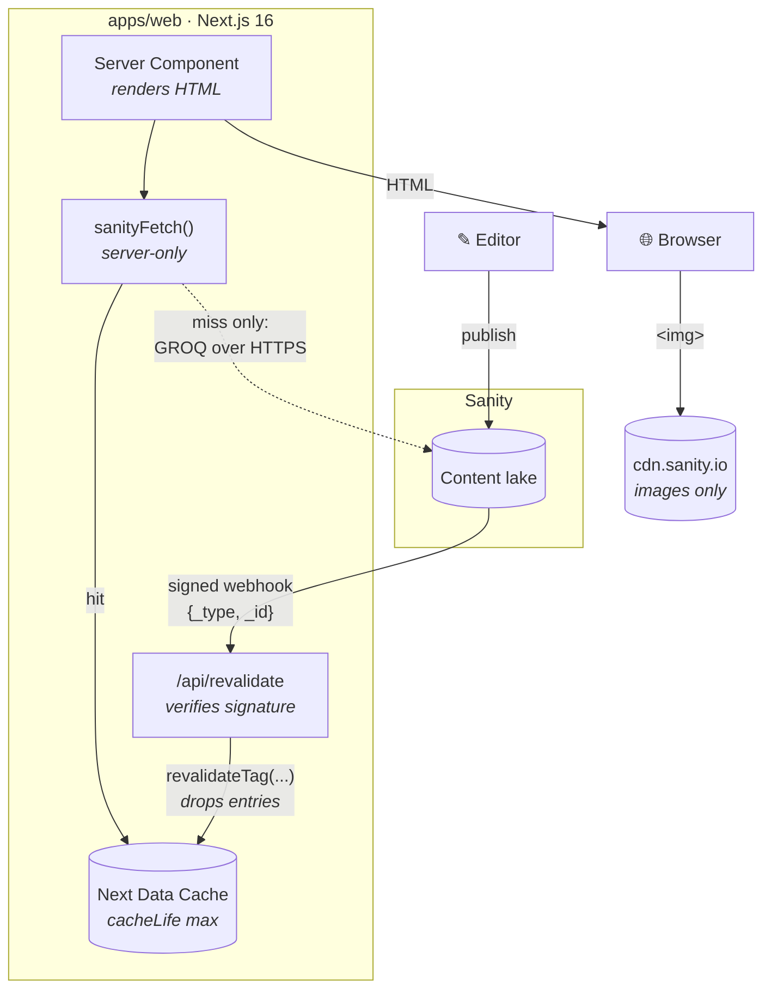

<!-- markdownlint-disable MD033 MD041 -->

<p align="center">
  
</p>

# Dětské skupiny

A public directory of Czech **dětské skupiny** — state-registered childcare
groups for under-fives. Parents browse more than 1,900 groups across the Czech
Republic through a four-level geography tree (country → region → area →
subarea), narrow the results by type, category and tag, search by name, and land
on a detail page with a photo gallery, daily schedule, pricing, opening details
and a map pin. Editors run the whole directory from a Sanity Studio, and the
site is served in Czech and English from two separate domains.

---

## Features

- **Interactive catalog.** Region and category filters, full-text name search
  and a clustered MapTiler map, all driven by URL state so any view is
  shareable and bookmarkable.
- **Rich group profiles.** Photo gallery, daily schedule, pricing, contact
  details, description in rich text, and the group's location on a map.
- **Bilingual content.** Czech and English served from separate domains, with
  each language edited as its own document so translations can diverge where
  they need to.
- **Articles.** A blog section with authors, categories and per-language posts,
  sitting beside the directory.
- **Editorial workspace.** The Sanity Studio sidebar is organised by the way an
  editor works — content pages, groups, geography, blog, translations, site
  settings — rather than as a flat list of document types.
- **Contact form.** Server-validated, delivered through Brevo, and protected
  from spam by Cloudflare Turnstile.

---

## Screenshots

<table>
  <tr>
    <td width="49%">
      
    </td>
    <td width="49%">
      
    </td>
  </tr>
  <tr>
    <td colspan="2" align="center"><em>The homepage at desktop and mobile widths.</em></td>
  </tr>
</table>


<p align="center"><em>
  Catalog, filtered to one region. Filters are URL state; the list streams
  behind a Suspense boundary while the shell paints.
</em></p>


<p align="center"><em>
  Group detail. The place list beside every map is the map's accessible
  alternative.
</em></p>

<table>
  <tr>
    <td width="49%">
      
    </td>
    <td width="49%">
      
    </td>
  </tr>
  <tr>
    <td colspan="2" align="center"><em>
      The Studio: the editorial sidebar, and the groups list grouped by language.
    </em></td>
  </tr>
</table>

---

## Tech stack

| | |
| --- | --- |
| **Next.js 16** | App Router, React Server Components and Cache Components. |
| **React 19** | With the React Compiler enabled for the web app. |
| **MUI 9** | Component library and design tokens, themed in `apps/web/src/theme`. |
| **Sanity v5** | Content lake and Studio — schemas, desk structure, migrations. |
| **next-intl** | Locale resolved from the request domain; no path prefix. |
| **TypeScript** | Across both apps, with Sanity query types generated from the schema. |
| **MapTiler** | Map rendering in the browser and publish-time geocoding in the Studio. |

---

## Architecture

The browser never talks to Sanity. The data client is `server-only`, so an
import from a client module fails the build; what reaches the browser is HTML,
plus images from Sanity's CDN.



1. An editor publishes. Sanity POSTs a signed `{_type, _id}` to
   `/api/revalidate`.
2. The route verifies the signature, maps `_type` to cache tags, and calls
   `revalidateTag`. An unmapped type drops a catch-all tag, so an unrecognised
   publish over-invalidates rather than doing nothing.
3. The next request for an affected page misses the cache, runs its GROQ, and
   re-fills it. Every other request is a cache hit.
4. Nothing expires on a timer. `cacheLife("max")` means the webhook is the only
   thing that makes a publish visible, which is why it fails closed: `401` on a
   bad signature, `503` on an unset secret.

### Monorepo

```text
detske-skupiny/
├── apps/
│   ├── web/          Next.js 16 front end — App Router, RSC, Cache Components
│   └── studio/       Sanity v5 Studio — schemas, desk structure, 1 plugin, migrations
├── packages/
│   ├── config/       Constants both apps must agree on (the locale list)
│   └── types/        Generated Sanity types — schema.json → sanity.generated.ts
├── e2e/              Playwright specs and the breadth-first full-site crawler
├── docs/             Testing, SEO and screenshot documentation
└── .github/          CI (every PR) and the weekly crawl
```

npm workspaces, one lockfile, no build orchestrator.

---

## Getting started

**Prerequisites:** Node ≥ 22 (`.nvmrc` pins it) and a Sanity project you can
read.

```bash
npm install                                     # one lockfile, all workspaces
cp apps/web/.env.example    apps/web/.env.local
cp apps/studio/.env.example apps/studio/.env.local
npm run dev:web                                 # localhost:3000
npm run dev:studio                              # localhost:3333
```

### Domain-based locale routing

`next-intl` picks the locale from the request's **Host**, not from a path
prefix — there is no `/en/…`. For local development, add to `/etc/hosts`:

```text
127.0.0.1 cs.school.local
127.0.0.1 en.school.local
```

Then browse `http://cs.school.local:3000`. The test suite maps Czech onto plain
`localhost` and English onto `en.localhost`, so `http://localhost:3000` resolves
to `cs`.

### Environment variables

| Name | App | Purpose | Where to obtain |
| --- | --- | --- | --- |
| `SANITY_PROJECT_ID` | web | Project the site reads content from | [sanity.io/manage](https://www.sanity.io/manage) → project → Settings |
| `SANITY_DATASET` | web | Dataset to read | e.g. `production` or `staging` |
| `SANITY_WEBHOOK_SECRET` | web | Verifies the publish webhook; unset ⇒ `/api/revalidate` returns 503 | Generate with `openssl rand -hex 32`; must match the webhook in Sanity manage |
| `NEXT_PUBLIC_CS_DOMAIN` | web | Host that serves the Czech site | e.g. `cs.school.local` locally |
| `NEXT_PUBLIC_EN_DOMAIN` | web | Host that serves the English site | e.g. `en.school.local` locally |
| `NEXT_PUBLIC_MAPTILER_API_KEY` | web | Map tiles and clustering | [cloud.maptiler.com](https://cloud.maptiler.com/account/keys/) → Keys |
| `BREVO_API_KEY` | web | Contact form delivery | [app.brevo.com](https://app.brevo.com/settings/api) → SMTP & API |
| `TURNSTILE_SECRET_KEY` | web | Server-side spam verification | [Cloudflare dash](https://dash.cloudflare.com/?to=/:account/turnstile) → Turnstile widget |
| `NEXT_PUBLIC_TURNSTILE_SITE_KEY` | web | Client widget; unset skips it in development | Same widget |
| `SANITY_STUDIO_PROJECT_ID` | studio | Same project as the web app | Sanity manage |
| `SANITY_STUDIO_DATASET` | studio | Same dataset as the web app | Sanity manage |
| `SANITY_STUDIO_API_VERSION` | studio | API date the Studio pins | A date, e.g. `2025-11-01` |
| `SANITY_STUDIO_GOOGLE_MAPS_API_KEY` | studio | The geopoint input | Google Cloud console → Maps JavaScript API |
| `SANITY_STUDIO_API_MAPTILER_API_KEY` | studio | Publish-time geocoding | Same MapTiler key |
| `SANITY_SCRIPT_TOKEN` | studio, Node only | Write token for the migration scripts; deliberately not `SANITY_STUDIO_*`-prefixed, since every such variable is inlined into the public Studio bundle | Sanity manage → API → Tokens (**Editor**) |

### Scripts

| Command | What it does |
| --- | --- |
| `npm run dev:web` · `npm run dev:studio` | Development servers on ports 3000 and 3333 |
| `npm run build` · `npm run lint` · `npm run typecheck` | Fan out across workspaces |
| `npm run start -w apps/web` | Serve the production build |
| `npm run typegen` | Extract the Studio schema and regenerate `packages/types`. Run after any schema change — CI fails on a dirty tree. |
| `npm run test` | Unit tests (Vitest), no network or credentials needed |
| `npm run test:e2e` | Playwright specs against a dev server and a real dataset |
| `npm run test:crawl` | Breadth-first crawl of every reachable page |
| `npm run test:all` | All three test layers in order |
| `npm run shots` | Capture the six README screenshots; see [docs/images/README.md](docs/images/README.md) |
| `npm run migrate:dictionary -w apps/studio` | Fill missing dictionary entries. Dry run by default; `-- --apply` to write. |

Full detail on the test layers and the CI gates they enforce is in
[docs/testing.md](docs/testing.md).

---

## Project structure

| Path | What lives there |
| --- | --- |
| `apps/web/src/app` | App Router routes, `sitemap.ts`, `robots.ts`, and the revalidate API route |
| `apps/web/src/features` | One folder per product area — catalog, school, blog, home, contact, cooperation — each with its own queries, components and state |
| `apps/web/src/sections` | Editor-composable page sections, resolved through a registry keyed by Sanity type |
| `apps/web/src/components` | Shared UI: layout chrome, form controls, rich text, map, primitives |
| `apps/web/src/lib` | Sanity client, GROQ fragments and queries, SEO helpers |
| `apps/web/src/theme` | MUI theme — palette, typography, component overrides, custom tokens |
| `apps/studio/schemaTypes` | Document and object schemas |
| `apps/studio/structure` | Desk structure: the sidebar sections and list definitions |
| `apps/studio/plugins` | The computed-fields publish plugin |
| `apps/studio/scripts` | Node-only content migration scripts |
| `packages/config` | Constants shared by both apps, including the locale list |
| `packages/types` | Generated Sanity schema and query result types |
| `e2e` | Playwright specs, helpers and the site crawler |
| `docs` | Testing, SEO and screenshot documentation |

---

## License

Proprietary — all rights reserved. See [LICENSE](LICENSE).
